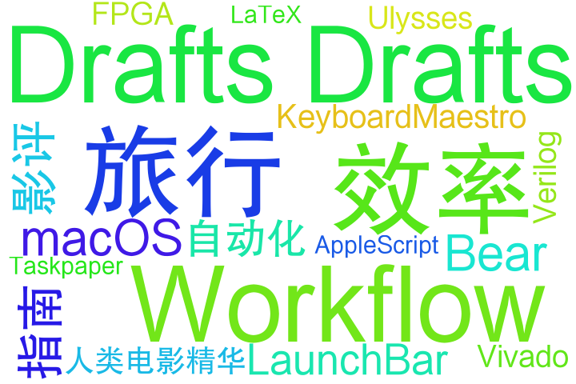

# TagCount

A snippet used to count the tags in your blog posts.

## Prerequisite

### Formatting

The tags should be written in the posts' metadata using YAML format. Example:

```yaml
---
title: Some Title
date: 1970/1/1
tags:
	- Tag_1
	- Tag_2
	- Tag_x
---

```

### Dependency

os, sys, argparse, markdown.

Use the following command to install all dependencies:

```
pip3 install -r requirements.txt
```

## Usage

There are two ways of using the snippet. The cli method:

```shell
$ python3 Tagcount.py --dir 'Users/Blog/Source/_posts/'
```

This will generate a `wordcloud.txt` in the directory where you run the script.

The coding method:

```python
import tagcount as tgc
file_list = []
file_list = tgc.scan('Users/Blog/Source/_posts/',file_list)
tags = tgc.count(file_list)
tgc.write_as_file(tags, '/Users/enoch/Desktop')
```

Note that the `count()` function returns a dictionary with the keys as tags and values as occurances. Therefore you may utilize this function to directly get the count instead of writing to a wordcloud file.

## Generate a Word Cloud

To generate a word cloud, use [word_cloud](https://github.com/amueller/word_cloud) on GitHub. For detailed usage please refer to: [WordCloud for Python documentation](https://amueller.github.io/word_cloud/index.html).

An example(with the word cloud text file already generated): 

```shell
wordcloud_cli --text wordcloud.txt --imagefile tags.png --fontfile /Users/enoch/Desktop/FZHTJW.TTF --background "white" --width 720 --height 480 
```

Yields:



Visit:

- [My Blog](https://enoch2090.me)

- [WhiteGivers](https://whitegivers.com)